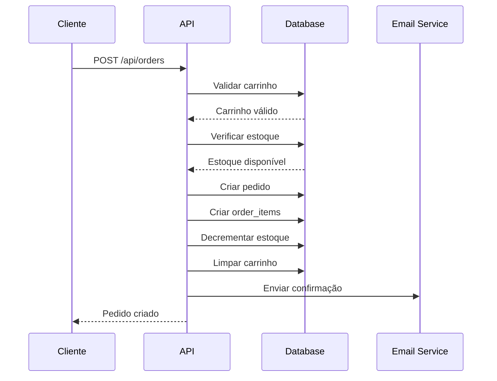
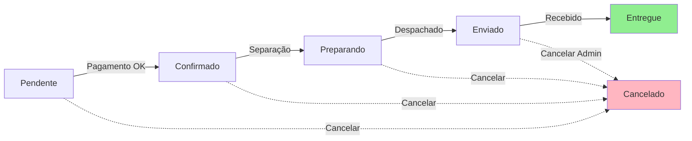
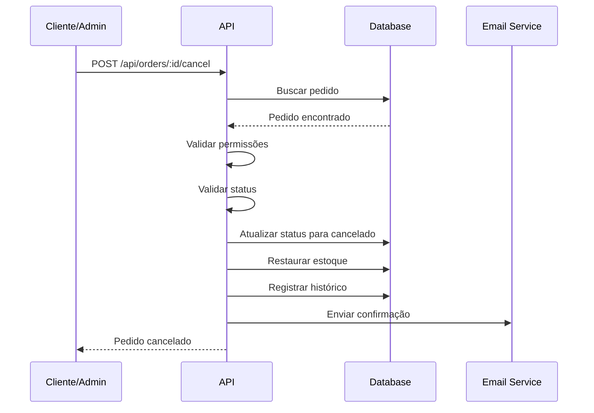

# API de Pedidos (Orders)

## Índice

- [Visão Geral](#visão-geral)
- [Endpoints](#endpoints)
  - [Criar Pedido](#criar-pedido)
  - [Listar Meus Pedidos](#listar-meus-pedidos)
  - [Buscar Pedido por ID](#buscar-pedido-por-id)
  - [Cancelar Pedido](#cancelar-pedido)
  - [Atualizar Status do Pedido (Admin)](#atualizar-status-do-pedido-admin)
  - [Adicionar Código de Rastreio (Admin)](#adicionar-código-de-rastreio-admin)
  - [Listar Todos os Pedidos (Admin)](#listar-todos-os-pedidos-admin)
  - [Estatísticas de Pedidos (Admin)](#estatísticas-de-pedidos-admin)
- [Modelos de Dados](#modelos-de-dados)
- [Códigos de Status](#códigos-de-status)
- [Regras de Negócio](#regras-de-negócio)
- [Fluxo de Pedido](#fluxo-de-pedido)

---

## Visão Geral

A API de Pedidos gerencia todo o ciclo de vida dos pedidos no e-commerce AutozPro, desde a criação até a entrega. Implementa controles de permissão para separar ações de clientes e administradores.

**Base URL:** `/api/orders`

**Autenticação:** Todos os endpoints requerem token JWT no header `Authorization: Bearer <token>`

**Permissões:**

- **Cliente:** Pode criar, visualizar seus próprios pedidos e cancelar pedidos pendentes
- **Admin:** Pode visualizar todos os pedidos, atualizar status e adicionar códigos de rastreio

---

## Endpoints

### Criar Pedido

Cria um novo pedido a partir dos itens no carrinho do usuário.

**Endpoint:** `POST /api/orders`

**Autenticação:** Requerida (Cliente ou Admin)

**Body:**

```json
{
  "endereco_entrega_id": "uuid-do-endereco",
  "metodo_pagamento": "cartao_credito",
  "observacoes": "Entregar no período da manhã"
}
```

**Campos:**

- `endereco_entrega_id` (string, obrigatório): UUID do endereço de entrega cadastrado
- `metodo_pagamento` (string, obrigatório): Método de pagamento escolhido
  - Valores aceitos: `cartao_credito`, `cartao_debito`, `pix`, `boleto`
- `observacoes` (string, opcional): Observações adicionais sobre o pedido

**Validações:**

- Carrinho não pode estar vazio
- Todos os produtos devem ter estoque disponível
- Endereço de entrega deve pertencer ao usuário
- Método de pagamento deve ser válido

**Resposta de Sucesso:** `201 Created`

```json
{
  "id": "uuid-do-pedido",
  "numero": "ORD-20241221-0001",
  "user_id": "uuid-do-usuario",
  "status": "pendente",
  "subtotal": 1299.9,
  "frete": 50.0,
  "desconto": 0.0,
  "total": 1349.9,
  "metodo_pagamento": "cartao_credito",
  "observacoes": "Entregar no período da manhã",
  "endereco_entrega": {
    "id": "uuid-do-endereco",
    "cep": "01310-100",
    "logradouro": "Avenida Paulista",
    "numero": "1578",
    "complemento": "Apto 101",
    "bairro": "Bela Vista",
    "cidade": "São Paulo",
    "estado": "SP"
  },
  "items": [
    {
      "id": "uuid-item-1",
      "produto": {
        "id": "uuid-produto-1",
        "codigo": "FIL-001",
        "nome": "Filtro de Óleo Mann W950/26",
        "imagem_url": "https://..."
      },
      "quantidade": 2,
      "preco_unitario": 89.9,
      "subtotal": 179.8
    },
    {
      "id": "uuid-item-2",
      "produto": {
        "id": "uuid-produto-2",
        "codigo": "PAST-102",
        "nome": "Pastilha de Freio Dianteira Bosch",
        "imagem_url": "https://..."
      },
      "quantidade": 1,
      "preco_unitario": 320.1,
      "subtotal": 320.1
    }
  ],
  "created_at": "2024-12-21T10:30:00Z",
  "updated_at": "2024-12-21T10:30:00Z"
}
```

**Respostas de Erro:**

`400 Bad Request` - Carrinho vazio

```json
{
  "error": "Carrinho vazio",
  "message": "Adicione itens ao carrinho antes de criar um pedido"
}
```

`400 Bad Request` - Produto sem estoque

```json
{
  "error": "Estoque insuficiente",
  "message": "O produto 'Filtro de Óleo Mann W950/26' não possui estoque suficiente",
  "produto_id": "uuid-do-produto",
  "estoque_disponivel": 1,
  "quantidade_solicitada": 2
}
```

`404 Not Found` - Endereço não encontrado

```json
{
  "error": "Endereço não encontrado",
  "message": "O endereço de entrega informado não existe ou não pertence ao usuário"
}
```

**Exemplo cURL:**

```bash
curl -X POST http://localhost:3000/api/orders \
  -H "Content-Type: application/json" \
  -H "Authorization: Bearer seu-token-jwt" \
  -d '{
    "endereco_entrega_id": "uuid-do-endereco",
    "metodo_pagamento": "cartao_credito",
    "observacoes": "Entregar no período da manhã"
  }'
```

**Exemplo JavaScript:**

```javascript
const criarPedido = async (dados) => {
  const response = await fetch("http://localhost:3000/api/orders", {
    method: "POST",
    headers: {
      "Content-Type": "application/json",
      Authorization: `Bearer ${token}`,
    },
    body: JSON.stringify(dados),
  });

  if (!response.ok) {
    const error = await response.json();
    throw new Error(error.message);
  }

  return await response.json();
};

// Uso
try {
  const pedido = await criarPedido({
    endereco_entrega_id: "uuid-do-endereco",
    metodo_pagamento: "cartao_credito",
    observacoes: "Entregar no período da manhã",
  });
  console.log("Pedido criado:", pedido.numero);
} catch (error) {
  console.error("Erro ao criar pedido:", error.message);
}
```

**Regras de Negócio:**

- O carrinho é esvaziado automaticamente após a criação do pedido
- Os produtos têm seu estoque decrementado automaticamente
- O número do pedido é gerado automaticamente no formato `ORD-YYYYMMDD-XXXX`
- O cálculo do frete é baseado no CEP de entrega (implementação futura pode integrar com APIs de transportadoras)
- O pedido é criado com status `pendente`
- Um e-mail de confirmação é enviado ao cliente (se configurado)

---

### Listar Meus Pedidos

Retorna a lista de pedidos do usuário autenticado.

**Endpoint:** `GET /api/orders`

**Autenticação:** Requerida (Cliente ou Admin)

**Query Parameters:**

- `page` (number, opcional, padrão: 1): Número da página
- `limit` (number, opcional, padrão: 10): Itens por página
- `status` (string, opcional): Filtrar por status
  - Valores: `pendente`, `confirmado`, `preparando`, `enviado`, `entregue`, `cancelado`
- `sort` (string, opcional, padrão: `created_at:desc`): Ordenação
  - Valores: `created_at:asc`, `created_at:desc`, `total:asc`, `total:desc`

**Resposta de Sucesso:** `200 OK`

```json
{
  "pedidos": [
    {
      "id": "uuid-pedido-1",
      "numero": "ORD-20241221-0001",
      "status": "enviado",
      "total": 1349.9,
      "metodo_pagamento": "cartao_credito",
      "codigo_rastreio": "BR123456789BR",
      "items_count": 2,
      "created_at": "2024-12-21T10:30:00Z",
      "updated_at": "2024-12-21T14:00:00Z"
    },
    {
      "id": "uuid-pedido-2",
      "numero": "ORD-20241220-0005",
      "status": "entregue",
      "total": 890.5,
      "metodo_pagamento": "pix",
      "codigo_rastreio": "BR987654321BR",
      "items_count": 3,
      "created_at": "2024-12-20T15:20:00Z",
      "updated_at": "2024-12-20T18:45:00Z"
    }
  ],
  "pagination": {
    "current_page": 1,
    "total_pages": 3,
    "total_items": 25,
    "items_per_page": 10
  }
}
```

**Exemplo cURL:**

```bash
curl -X GET "http://localhost:3000/api/orders?page=1&limit=10&status=enviado" \
  -H "Authorization: Bearer seu-token-jwt"
```

**Exemplo JavaScript:**

```javascript
const listarMeusPedidos = async (filtros = {}) => {
  const params = new URLSearchParams({
    page: filtros.page || 1,
    limit: filtros.limit || 10,
    ...(filtros.status && { status: filtros.status }),
    ...(filtros.sort && { sort: filtros.sort }),
  });

  const response = await fetch(`http://localhost:3000/api/orders?${params}`, {
    headers: {
      Authorization: `Bearer ${token}`,
    },
  });

  return await response.json();
};

// Uso
const pedidos = await listarMeusPedidos({ status: "enviado", page: 1 });
```

---

### Buscar Pedido por ID

Retorna os detalhes completos de um pedido específico.

**Endpoint:** `GET /api/orders/:id`

**Autenticação:** Requerida (Cliente ou Admin)

**Parâmetros de URL:**

- `id` (string, obrigatório): UUID do pedido

**Permissões:**

- Cliente: Pode visualizar apenas seus próprios pedidos
- Admin: Pode visualizar qualquer pedido

**Resposta de Sucesso:** `200 OK`

```json
{
  "id": "uuid-do-pedido",
  "numero": "ORD-20241221-0001",
  "user": {
    "id": "uuid-do-usuario",
    "nome": "João Silva",
    "email": "joao.silva@email.com",
    "telefone": "(11) 98765-4321"
  },
  "status": "enviado",
  "status_historico": [
    {
      "status": "pendente",
      "data": "2024-12-21T10:30:00Z",
      "observacao": "Pedido criado"
    },
    {
      "status": "confirmado",
      "data": "2024-12-21T11:00:00Z",
      "observacao": "Pagamento confirmado"
    },
    {
      "status": "preparando",
      "data": "2024-12-21T12:30:00Z",
      "observacao": "Pedido em separação"
    },
    {
      "status": "enviado",
      "data": "2024-12-21T14:00:00Z",
      "observacao": "Pedido enviado para transportadora"
    }
  ],
  "subtotal": 1299.9,
  "frete": 50.0,
  "desconto": 0.0,
  "total": 1349.9,
  "metodo_pagamento": "cartao_credito",
  "observacoes": "Entregar no período da manhã",
  "codigo_rastreio": "BR123456789BR",
  "endereco_entrega": {
    "cep": "01310-100",
    "logradouro": "Avenida Paulista",
    "numero": "1578",
    "complemento": "Apto 101",
    "bairro": "Bela Vista",
    "cidade": "São Paulo",
    "estado": "SP"
  },
  "items": [
    {
      "id": "uuid-item-1",
      "produto": {
        "id": "uuid-produto-1",
        "codigo": "FIL-001",
        "nome": "Filtro de Óleo Mann W950/26",
        "imagem_url": "https://...",
        "categoria": "Filtros"
      },
      "quantidade": 2,
      "preco_unitario": 89.9,
      "subtotal": 179.8
    },
    {
      "id": "uuid-item-2",
      "produto": {
        "id": "uuid-produto-2",
        "codigo": "PAST-102",
        "nome": "Pastilha de Freio Dianteira Bosch",
        "imagem_url": "https://...",
        "categoria": "Freios"
      },
      "quantidade": 1,
      "preco_unitario": 320.1,
      "subtotal": 320.1
    }
  ],
  "created_at": "2024-12-21T10:30:00Z",
  "updated_at": "2024-12-21T14:00:00Z"
}
```

**Respostas de Erro:**

`404 Not Found` - Pedido não encontrado

```json
{
  "error": "Pedido não encontrado",
  "message": "O pedido solicitado não existe"
}
```

`403 Forbidden` - Sem permissão

```json
{
  "error": "Acesso negado",
  "message": "Você não tem permissão para visualizar este pedido"
}
```

**Exemplo cURL:**

```bash
curl -X GET http://localhost:3000/api/orders/uuid-do-pedido \
  -H "Authorization: Bearer seu-token-jwt"
```

**Exemplo JavaScript:**

```javascript
const buscarPedido = async (pedidoId) => {
  const response = await fetch(`http://localhost:3000/api/orders/${pedidoId}`, {
    headers: {
      Authorization: `Bearer ${token}`,
    },
  });

  if (!response.ok) {
    throw new Error("Pedido não encontrado");
  }

  return await response.json();
};
```

---

### Cancelar Pedido

Cancela um pedido existente. Apenas pedidos com status `pendente` ou `confirmado` podem ser cancelados pelo cliente.

**Endpoint:** `POST /api/orders/:id/cancel`

**Autenticação:** Requerida (Cliente ou Admin)

**Parâmetros de URL:**

- `id` (string, obrigatório): UUID do pedido

**Body:**

```json
{
  "motivo": "Desistência da compra"
}
```

**Campos:**

- `motivo` (string, opcional): Motivo do cancelamento

**Permissões:**

- Cliente: Pode cancelar apenas pedidos `pendente` ou `confirmado`
- Admin: Pode cancelar pedidos em qualquer status (exceto `entregue` ou `cancelado`)

**Resposta de Sucesso:** `200 OK`

```json
{
  "id": "uuid-do-pedido",
  "numero": "ORD-20241221-0001",
  "status": "cancelado",
  "motivo_cancelamento": "Desistência da compra",
  "cancelado_em": "2024-12-21T15:30:00Z",
  "updated_at": "2024-12-21T15:30:00Z"
}
```

**Respostas de Erro:**

`400 Bad Request` - Pedido não pode ser cancelado

```json
{
  "error": "Cancelamento não permitido",
  "message": "Pedidos com status 'enviado' não podem ser cancelados. Entre em contato com o suporte."
}
```

`404 Not Found` - Pedido não encontrado

```json
{
  "error": "Pedido não encontrado",
  "message": "O pedido solicitado não existe"
}
```

**Exemplo cURL:**

```bash
curl -X POST http://localhost:3000/api/orders/uuid-do-pedido/cancel \
  -H "Content-Type: application/json" \
  -H "Authorization: Bearer seu-token-jwt" \
  -d '{
    "motivo": "Desistência da compra"
  }'
```

**Exemplo JavaScript:**

```javascript
const cancelarPedido = async (pedidoId, motivo) => {
  const response = await fetch(
    `http://localhost:3000/api/orders/${pedidoId}/cancel`,
    {
      method: "POST",
      headers: {
        "Content-Type": "application/json",
        Authorization: `Bearer ${token}`,
      },
      body: JSON.stringify({ motivo }),
    }
  );

  if (!response.ok) {
    const error = await response.json();
    throw new Error(error.message);
  }

  return await response.json();
};
```

**Regras de Negócio:**

- O estoque dos produtos é restaurado automaticamente
- Um e-mail de confirmação de cancelamento é enviado ao cliente
- O histórico de status é atualizado com o cancelamento
- Pedidos cancelados não podem ser reativados

---

### Atualizar Status do Pedido (Admin)

Atualiza o status de um pedido. Apenas administradores podem usar este endpoint.

**Endpoint:** `PATCH /api/orders/:id/status`

**Autenticação:** Requerida (Admin apenas)

**Parâmetros de URL:**

- `id` (string, obrigatório): UUID do pedido

**Body:**

```json
{
  "status": "enviado",
  "observacao": "Pedido enviado via transportadora XYZ"
}
```

**Campos:**

- `status` (string, obrigatório): Novo status do pedido
  - Valores: `pendente`, `confirmado`, `preparando`, `enviado`, `entregue`, `cancelado`
- `observacao` (string, opcional): Observação sobre a mudança de status

**Validações:**

- Status deve seguir o fluxo lógico (não pode voltar status, exceto para cancelamento)
- Pedidos `entregue` ou `cancelado` não podem ter status alterado

**Resposta de Sucesso:** `200 OK`

```json
{
  "id": "uuid-do-pedido",
  "numero": "ORD-20241221-0001",
  "status": "enviado",
  "status_historico": [
    {
      "status": "pendente",
      "data": "2024-12-21T10:30:00Z",
      "observacao": "Pedido criado"
    },
    {
      "status": "confirmado",
      "data": "2024-12-21T11:00:00Z",
      "observacao": "Pagamento confirmado"
    },
    {
      "status": "preparando",
      "data": "2024-12-21T12:30:00Z",
      "observacao": "Pedido em separação"
    },
    {
      "status": "enviado",
      "data": "2024-12-21T14:00:00Z",
      "observacao": "Pedido enviado via transportadora XYZ"
    }
  ],
  "updated_at": "2024-12-21T14:00:00Z"
}
```

**Respostas de Erro:**

`400 Bad Request` - Status inválido

```json
{
  "error": "Status inválido",
  "message": "Não é possível alterar de 'enviado' para 'pendente'"
}
```

`403 Forbidden` - Sem permissão

```json
{
  "error": "Acesso negado",
  "message": "Apenas administradores podem atualizar o status de pedidos"
}
```

**Exemplo cURL:**

```bash
curl -X PATCH http://localhost:3000/api/orders/uuid-do-pedido/status \
  -H "Content-Type: application/json" \
  -H "Authorization: Bearer token-admin" \
  -d '{
    "status": "enviado",
    "observacao": "Pedido enviado via transportadora XYZ"
  }'
```

**Exemplo JavaScript:**

```javascript
const atualizarStatusPedido = async (pedidoId, status, observacao) => {
  const response = await fetch(
    `http://localhost:3000/api/orders/${pedidoId}/status`,
    {
      method: "PATCH",
      headers: {
        "Content-Type": "application/json",
        Authorization: `Bearer ${adminToken}`,
      },
      body: JSON.stringify({ status, observacao }),
    }
  );

  return await response.json();
};
```

**Fluxo de Status Válido:**

```
pendente → confirmado → preparando → enviado → entregue
     ↓          ↓            ↓          ↓
  cancelado  cancelado   cancelado  cancelado
```

---

### Adicionar Código de Rastreio (Admin)

Adiciona ou atualiza o código de rastreio de um pedido. Apenas administradores podem usar este endpoint.

**Endpoint:** `PATCH /api/orders/:id/tracking`

**Autenticação:** Requerida (Admin apenas)

**Parâmetros de URL:**

- `id` (string, obrigatório): UUID do pedido

**Body:**

```json
{
  "codigo_rastreio": "BR123456789BR",
  "transportadora": "Correios"
}
```

**Campos:**

- `codigo_rastreio` (string, obrigatório): Código de rastreio da transportadora
- `transportadora` (string, opcional): Nome da transportadora

**Validações:**

- Pedido deve estar com status `enviado`
- Código de rastreio não pode ser vazio

**Resposta de Sucesso:** `200 OK`

```json
{
  "id": "uuid-do-pedido",
  "numero": "ORD-20241221-0001",
  "status": "enviado",
  "codigo_rastreio": "BR123456789BR",
  "transportadora": "Correios",
  "updated_at": "2024-12-21T14:30:00Z"
}
```

**Respostas de Erro:**

`400 Bad Request` - Status inválido para rastreio

```json
{
  "error": "Operação inválida",
  "message": "Código de rastreio só pode ser adicionado a pedidos com status 'enviado'"
}
```

`403 Forbidden` - Sem permissão

```json
{
  "error": "Acesso negado",
  "message": "Apenas administradores podem adicionar códigos de rastreio"
}
```

**Exemplo cURL:**

```bash
curl -X PATCH http://localhost:3000/api/orders/uuid-do-pedido/tracking \
  -H "Content-Type: application/json" \
  -H "Authorization: Bearer token-admin" \
  -d '{
    "codigo_rastreio": "BR123456789BR",
    "transportadora": "Correios"
  }'
```

**Exemplo JavaScript:**

```javascript
const adicionarRastreio = async (pedidoId, codigoRastreio, transportadora) => {
  const response = await fetch(
    `http://localhost:3000/api/orders/${pedidoId}/tracking`,
    {
      method: "PATCH",
      headers: {
        "Content-Type": "application/json",
        Authorization: `Bearer ${adminToken}`,
      },
      body: JSON.stringify({ codigo_rastreio: codigoRastreio, transportadora }),
    }
  );

  return await response.json();
};
```

**Regras de Negócio:**

- Um e-mail com o código de rastreio é enviado automaticamente ao cliente
- O código de rastreio pode ser atualizado se necessário

---

### Listar Todos os Pedidos (Admin)

Retorna a lista de todos os pedidos do sistema. Apenas administradores podem usar este endpoint.

**Endpoint:** `GET /api/admin/orders`

**Autenticação:** Requerida (Admin apenas)

**Query Parameters:**

- `page` (number, opcional, padrão: 1): Número da página
- `limit` (number, opcional, padrão: 10): Itens por página
- `status` (string, opcional): Filtrar por status
- `user_id` (string, opcional): Filtrar por ID do usuário
- `data_inicio` (string, opcional): Filtrar por data inicial (ISO 8601)
- `data_fim` (string, opcional): Filtrar por data final (ISO 8601)
- `metodo_pagamento` (string, opcional): Filtrar por método de pagamento
- `sort` (string, opcional, padrão: `created_at:desc`): Ordenação

**Resposta de Sucesso:** `200 OK`

```json
{
  "pedidos": [
    {
      "id": "uuid-pedido-1",
      "numero": "ORD-20241221-0001",
      "user": {
        "id": "uuid-usuario-1",
        "nome": "João Silva",
        "email": "joao.silva@email.com"
      },
      "status": "enviado",
      "total": 1349.9,
      "metodo_pagamento": "cartao_credito",
      "codigo_rastreio": "BR123456789BR",
      "items_count": 2,
      "created_at": "2024-12-21T10:30:00Z"
    },
    {
      "id": "uuid-pedido-2",
      "numero": "ORD-20241221-0002",
      "user": {
        "id": "uuid-usuario-2",
        "nome": "Maria Santos",
        "email": "maria.santos@email.com"
      },
      "status": "confirmado",
      "total": 589.9,
      "metodo_pagamento": "pix",
      "codigo_rastreio": null,
      "items_count": 1,
      "created_at": "2024-12-21T11:15:00Z"
    }
  ],
  "pagination": {
    "current_page": 1,
    "total_pages": 15,
    "total_items": 145,
    "items_per_page": 10
  },
  "resumo": {
    "total_pedidos": 145,
    "valor_total": 125890.5,
    "por_status": {
      "pendente": 12,
      "confirmado": 25,
      "preparando": 18,
      "enviado": 45,
      "entregue": 38,
      "cancelado": 7
    }
  }
}
```

**Exemplo cURL:**

```bash
curl -X GET "http://localhost:3000/api/admin/orders?page=1&status=enviado&data_inicio=2024-12-01" \
  -H "Authorization: Bearer token-admin"
```

**Exemplo JavaScript:**

```javascript
const listarTodosPedidos = async (filtros = {}) => {
  const params = new URLSearchParams({
    page: filtros.page || 1,
    limit: filtros.limit || 10,
    ...(filtros.status && { status: filtros.status }),
    ...(filtros.user_id && { user_id: filtros.user_id }),
    ...(filtros.data_inicio && { data_inicio: filtros.data_inicio }),
    ...(filtros.data_fim && { data_fim: filtros.data_fim }),
  });

  const response = await fetch(
    `http://localhost:3000/api/admin/orders?${params}`,
    {
      headers: {
        Authorization: `Bearer ${adminToken}`,
      },
    }
  );

  return await response.json();
};
```

---

### Estatísticas de Pedidos (Admin)

Retorna estatísticas e métricas sobre os pedidos. Apenas administradores podem usar este endpoint.

**Endpoint:** `GET /api/admin/orders/stats`

**Autenticação:** Requerida (Admin apenas)

**Query Parameters:**

- `periodo` (string, opcional, padrão: `mes`): Período de análise
  - Valores: `hoje`, `semana`, `mes`, `ano`, `custom`
- `data_inicio` (string, opcional): Data inicial para período customizado (ISO 8601)
- `data_fim` (string, opcional): Data final para período customizado (ISO 8601)

**Resposta de Sucesso:** `200 OK`

```json
{
  "periodo": {
    "tipo": "mes",
    "inicio": "2024-12-01T00:00:00Z",
    "fim": "2024-12-31T23:59:59Z"
  },
  "resumo_geral": {
    "total_pedidos": 145,
    "receita_total": 125890.5,
    "ticket_medio": 868.21,
    "produtos_vendidos": 423
  },
  "por_status": {
    "pendente": {
      "quantidade": 12,
      "percentual": 8.3,
      "valor_total": 10450.0
    },
    "confirmado": {
      "quantidade": 25,
      "percentual": 17.2,
      "valor_total": 21560.75
    },
    "preparando": {
      "quantidade": 18,
      "percentual": 12.4,
      "valor_total": 15670.3
    },
    "enviado": {
      "quantidade": 45,
      "percentual": 31.0,
      "valor_total": 39120.8
    },
    "entregue": {
      "quantidade": 38,
      "percentual": 26.2,
      "valor_total": 33089.45
    },
    "cancelado": {
      "quantidade": 7,
      "percentual": 4.8,
      "valor_total": 5999.2
    }
  },
  "por_metodo_pagamento": {
    "cartao_credito": {
      "quantidade": 68,
      "percentual": 46.9,
      "valor_total": 59045.3
    },
    "pix": {
      "quantidade": 52,
      "percentual": 35.9,
      "valor_total": 45123.6
    },
    "cartao_debito": {
      "quantidade": 18,
      "percentual": 12.4,
      "valor_total": 15621.4
    },
    "boleto": {
      "quantidade": 7,
      "percentual": 4.8,
      "valor_total": 6100.2
    }
  },
  "produtos_mais_vendidos": [
    {
      "produto_id": "uuid-produto-1",
      "codigo": "FIL-001",
      "nome": "Filtro de Óleo Mann W950/26",
      "quantidade_vendida": 156,
      "receita_total": 14024.4
    },
    {
      "produto_id": "uuid-produto-2",
      "codigo": "PAST-102",
      "nome": "Pastilha de Freio Dianteira Bosch",
      "quantidade_vendida": 89,
      "receita_total": 28488.9
    },
    {
      "produto_id": "uuid-produto-3",
      "codigo": "LAMP-205",
      "nome": "Lâmpada H7 Philips",
      "quantidade_vendida": 67,
      "receita_total": 3685.5
    }
  ],
  "evolucao_diaria": [
    {
      "data": "2024-12-01",
      "pedidos": 5,
      "receita": 4350.2
    },
    {
      "data": "2024-12-02",
      "pedidos": 8,
      "receita": 6920.5
    },
    {
      "data": "2024-12-03",
      "pedidos": 6,
      "receita": 5230.8
    }
  ],
  "taxa_conversao": {
    "pedidos_concluidos": 38,
    "pedidos_cancelados": 7,
    "taxa_cancelamento": 4.8,
    "taxa_conclusao": 26.2
  },
  "tempo_medio_entrega": {
    "dias": 5.3,
    "horas": 127.2
  }
}
```

**Exemplo cURL:**

```bash
curl -X GET "http://localhost:3000/api/admin/orders/stats?periodo=mes" \
  -H "Authorization: Bearer token-admin"
```

**Exemplo JavaScript:**

```javascript
const obterEstatisticas = async (periodo = "mes") => {
  const response = await fetch(
    `http://localhost:3000/api/admin/orders/stats?periodo=${periodo}`,
    {
      headers: {
        Authorization: `Bearer ${adminToken}`,
      },
    }
  );

  return await response.json();
};

// Uso
const stats = await obterEstatisticas("mes");
console.log(`Total de pedidos: ${stats.resumo_geral.total_pedidos}`);
console.log(`Receita total: R$ ${stats.resumo_geral.receita_total.toFixed(2)}`);
```

**Exemplo com período customizado:**

```javascript
const obterEstatisticasCustom = async (dataInicio, dataFim) => {
  const params = new URLSearchParams({
    periodo: "custom",
    data_inicio: dataInicio,
    data_fim: dataFim,
  });

  const response = await fetch(
    `http://localhost:3000/api/admin/orders/stats?${params}`,
    {
      headers: {
        Authorization: `Bearer ${adminToken}`,
      },
    }
  );

  return await response.json();
};

// Obter estatísticas do último trimestre
const stats = await obterEstatisticasCustom("2024-10-01", "2024-12-31");
```

---

## Modelos de Dados

### Order (Pedido)

```typescript
interface Order {
  id: string; // UUID do pedido
  numero: string; // Número do pedido (ORD-YYYYMMDD-XXXX)
  user_id: string; // UUID do usuário
  status: OrderStatus; // Status atual do pedido
  subtotal: number; // Valor dos produtos
  frete: number; // Valor do frete
  desconto: number; // Valor de desconto aplicado
  total: number; // Valor total do pedido
  metodo_pagamento: PaymentMethod; // Método de pagamento
  endereco_entrega_id: string; // UUID do endereço de entrega
  observacoes?: string; // Observações do cliente
  codigo_rastreio?: string; // Código de rastreio da transportadora
  transportadora?: string; // Nome da transportadora
  motivo_cancelamento?: string; // Motivo do cancelamento (se aplicável)
  cancelado_em?: Date; // Data/hora do cancelamento
  created_at: Date; // Data/hora de criação
  updated_at: Date; // Data/hora da última atualização
}
```

### OrderItem (Item do Pedido)

```typescript
interface OrderItem {
  id: string; // UUID do item
  order_id: string; // UUID do pedido
  produto_id: string; // UUID do produto
  quantidade: number; // Quantidade comprada
  preco_unitario: number; // Preço unitário no momento da compra
  subtotal: number; // Subtotal do item (quantidade × preço)
  created_at: Date; // Data/hora de criação
}
```

### OrderStatusHistory (Histórico de Status)

```typescript
interface OrderStatusHistory {
  id: string; // UUID do registro
  order_id: string; // UUID do pedido
  status: OrderStatus; // Status registrado
  observacao?: string; // Observação sobre a mudança
  alterado_por?: string; // UUID do usuário que alterou
  data: Date; // Data/hora da mudança
}
```

---

## Códigos de Status

### OrderStatus

| Status       | Descrição                                          | Ações Permitidas             |
| ------------ | -------------------------------------------------- | ---------------------------- |
| `pendente`   | Pedido criado, aguardando confirmação de pagamento | Cancelar, Confirmar          |
| `confirmado` | Pagamento confirmado                               | Cancelar, Preparar           |
| `preparando` | Pedido em separação                                | Cancelar, Enviar             |
| `enviado`    | Pedido enviado para entrega                        | Adicionar rastreio, Entregar |
| `entregue`   | Pedido entregue ao cliente                         | Nenhuma                      |
| `cancelado`  | Pedido cancelado                                   | Nenhuma                      |

### PaymentMethod

| Método           | Descrição         |
| ---------------- | ----------------- |
| `cartao_credito` | Cartão de Crédito |
| `cartao_debito`  | Cartão de Débito  |
| `pix`            | PIX               |
| `boleto`         | Boleto Bancário   |

---

## Regras de Negócio

### Criação de Pedidos

1. **Validação de Carrinho:**

   - O carrinho não pode estar vazio
   - Todos os produtos devem estar ativos no sistema
   - Todos os produtos devem ter estoque suficiente

2. **Geração de Número:**

   - Formato: `ORD-YYYYMMDD-XXXX`
   - Sequencial por dia (reinicia a cada dia)
   - Exemplo: `ORD-20241221-0001`

3. **Cálculo de Valores:**

   - `subtotal`: Soma de (quantidade × preço_unitario) de todos os itens
   - `frete`: Calculado com base no CEP de entrega
   - `desconto`: Aplicado se houver cupom válido
   - `total`: (subtotal + frete) - desconto

4. **Gestão de Estoque:**

   - Estoque é decrementado automaticamente na criação
   - Estoque é restaurado automaticamente no cancelamento
   - Reserva temporária durante o checkout (15 minutos)

5. **Status Inicial:**
   - Todos os pedidos são criados com status `pendente`
   - Histórico de status é criado automaticamente

### Cancelamento de Pedidos

1. **Permissões:**

   - Cliente pode cancelar apenas pedidos `pendente` ou `confirmado`
   - Admin pode cancelar pedidos em qualquer status (exceto `entregue` ou `cancelado`)

2. **Consequências:**

   - Estoque é restaurado automaticamente
   - Status alterado para `cancelado`
   - Data de cancelamento registrada
   - E-mail de confirmação enviado

3. **Restrições:**
   - Pedidos `entregue` não podem ser cancelados
   - Pedidos já `cancelado` não podem ser cancelados novamente
   - Pedidos `enviado` requerem contato com suporte (para cliente)

### Atualização de Status

1. **Fluxo Linear:**

   ```
   pendente → confirmado → preparando → enviado → entregue
   ```

2. **Validações:**

   - Não é possível voltar status (exceto para cancelamento)
   - Pedidos `entregue` ou `cancelado` são finais
   - Cada mudança é registrada no histórico

3. **Notificações:**
   - Cliente é notificado por e-mail em cada mudança de status
   - Notificações incluem link para rastreamento (quando disponível)

### Código de Rastreio

1. **Requisitos:**

   - Só pode ser adicionado a pedidos com status `enviado`
   - Código de rastreio não pode ser vazio
   - Pode ser atualizado se necessário

2. **Notificação:**
   - E-mail automático enviado ao cliente com código de rastreio
   - Link direto para rastreamento (se transportadora suportada)

---

## Fluxo de Pedido

### 1. Criação do Pedido



### 2. Fluxo de Status



### 3. Cancelamento



---

## Exemplos Práticos

### Exemplo 1: Fluxo Completo de Compra

```javascript
// 1. Adicionar produtos ao carrinho
await adicionarAoCarrinho("uuid-produto-1", 2);
await adicionarAoCarrinho("uuid-produto-2", 1);

// 2. Criar pedido
const pedido = await criarPedido({
  endereco_entrega_id: "uuid-endereco",
  metodo_pagamento: "cartao_credito",
  observacoes: "Entregar no período da manhã",
});

console.log(`Pedido criado: ${pedido.numero}`);
console.log(`Total: R$ ${pedido.total.toFixed(2)}`);

// 3. Acompanhar status
const pedidoAtualizado = await buscarPedido(pedido.id);
console.log(`Status atual: ${pedidoAtualizado.status}`);

if (pedidoAtualizado.codigo_rastreio) {
  console.log(`Rastreio: ${pedidoAtualizado.codigo_rastreio}`);
}
```

### Exemplo 2: Gestão de Pedidos (Admin)

```javascript
// Listar pedidos pendentes
const pedidosPendentes = await listarTodosPedidos({
  status: "pendente",
  limit: 20,
});

// Confirmar pagamento e atualizar status
for (const pedido of pedidosPendentes.pedidos) {
  await atualizarStatusPedido(
    pedido.id,
    "confirmado",
    "Pagamento confirmado via gateway"
  );
}

// Adicionar código de rastreio para pedidos enviados
const pedidosEnviados = await listarTodosPedidos({
  status: "enviado",
  limit: 50,
});

for (const pedido of pedidosEnviados.pedidos) {
  if (!pedido.codigo_rastreio) {
    await adicionarRastreio(pedido.id, `BR${Date.now()}BR`, "Correios");
  }
}
```

### Exemplo 3: Dashboard de Estatísticas

```javascript
// Obter estatísticas do mês
const stats = await obterEstatisticas("mes");

console.log("=== DASHBOARD DE VENDAS ===");
console.log(`Total de Pedidos: ${stats.resumo_geral.total_pedidos}`);
console.log(`Receita Total: R$ ${stats.resumo_geral.receita_total.toFixed(2)}`);
console.log(`Ticket Médio: R$ ${stats.resumo_geral.ticket_medio.toFixed(2)}`);
console.log(`\nPor Status:`);

Object.entries(stats.por_status).forEach(([status, dados]) => {
  console.log(`  ${status}: ${dados.quantidade} (${dados.percentual}%)`);
});

console.log(
  `\nTaxa de Cancelamento: ${stats.taxa_conversao.taxa_cancelamento}%`
);
console.log(`Tempo Médio de Entrega: ${stats.tempo_medio_entrega.dias} dias`);
```

### Exemplo 4: Tratamento de Erros

```javascript
const processarPedido = async (dadosPedido) => {
  try {
    const pedido = await criarPedido(dadosPedido);
    return {
      sucesso: true,
      pedido,
      mensagem: `Pedido ${pedido.numero} criado com sucesso!`,
    };
  } catch (error) {
    // Tratar diferentes tipos de erro
    if (error.message.includes("Carrinho vazio")) {
      return {
        sucesso: false,
        erro: "CARRINHO_VAZIO",
        mensagem: "Adicione produtos ao carrinho antes de finalizar",
      };
    }

    if (error.message.includes("Estoque insuficiente")) {
      return {
        sucesso: false,
        erro: "ESTOQUE_INSUFICIENTE",
        mensagem: "Alguns produtos não possuem estoque suficiente",
      };
    }

    if (error.message.includes("Endereço não encontrado")) {
      return {
        sucesso: false,
        erro: "ENDERECO_INVALIDO",
        mensagem: "Selecione um endereço de entrega válido",
      };
    }

    // Erro genérico
    return {
      sucesso: false,
      erro: "ERRO_DESCONHECIDO",
      mensagem: "Ocorreu um erro ao processar seu pedido",
    };
  }
};

// Uso
const resultado = await processarPedido({
  endereco_entrega_id: "uuid-endereco",
  metodo_pagamento: "pix",
});

if (resultado.sucesso) {
  console.log(resultado.mensagem);
  // Redirecionar para página de confirmação
} else {
  console.error(resultado.mensagem);
  // Mostrar mensagem de erro ao usuário
}
```

---

## Relacionamentos com Outras APIs

### Com API de Produtos

- Valida disponibilidade e estoque de produtos
- Captura preços no momento da compra
- Decrementa/restaura estoque automaticamente

### Com API de Carrinho

- Cria pedido a partir dos itens do carrinho
- Limpa carrinho após criação do pedido
- Valida quantidades antes de processar

### Com API de Usuários

- Valida autenticação e permissões
- Busca dados do usuário para o pedido
- Valida endereços de entrega

### Com API de Autenticação

- Requer token JWT válido
- Valida role do usuário (cliente/admin)
- Controla acesso aos endpoints administrativos

---

## Notas de Implementação

### Performance

- Use índices no banco de dados para `user_id`, `status`, `created_at`
- Implemente cache para estatísticas (atualização a cada 5 minutos)
- Use paginação em todas as listagens

### Segurança

- Sempre valide se o usuário tem permissão para acessar o pedido
- Sanitize entradas do usuário
- Use prepared statements para prevenir SQL injection
- Implemente rate limiting nos endpoints de criação

### Notificações

- Configure fila de e-mails para não bloquear a API
- Implemente retry logic para falhas de envio
- Registre todas as tentativas de notificação

### Auditoria

- Registre todas as mudanças de status no histórico
- Mantenha log de quem alterou cada pedido
- Implemente soft delete para pedidos cancelados

---

## Conclusão

Esta documentação cobre todos os aspectos da API de Pedidos do AutozPro. Para questões relacionadas a autenticação, consulte [authentication.md](./authentication.md). Para informações sobre produtos e estoque, consulte [products.md](./products.md).

**Próximos Passos:**

- Implementar integração com gateways de pagamento
- Adicionar webhooks para notificações em tempo real
- Implementar API de rastreamento integrada com transportadoras
- Criar relatórios avançados de vendas
