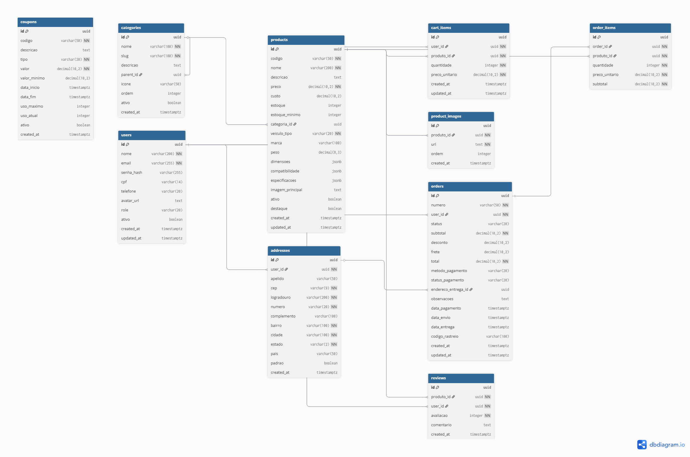

# 🔗 Relacionamentos do Banco de Dados

Documentação dos relacionamentos entre as tabelas.

---

## 📊 Diagrama ER Completo



---

## 🔑 Tipos de Relacionamentos

### Legenda

- **1:N** (Um para Muitos) - Uma entidade se relaciona com várias
- **N:1** (Muitos para Um) - Várias entidades se relacionam com uma
- **1:1** (Um para Um) - Relacionamento único
- **N:N** (Muitos para Muitos) - Várias para várias (requer tabela intermediária)

---

## 👤 users → Relacionamentos

### users 1:N cart_items

**Descrição:** Um usuário pode ter vários itens no carrinho.

**Chave Estrangeira:** `cart_items.user_id → users.id`

**Cascade:** `ON DELETE CASCADE` (ao deletar usuário, deleta o carrinho)

**Exemplo:**

```
User (id: 123)
  ├── Cart Item 1 (Filtro de Óleo)
  ├── Cart Item 2 (Pastilha de Freio)
  └── Cart Item 3 (Disco de Freio)
```

---

### users 1:N orders

**Descrição:** Um usuário pode fazer vários pedidos.

**Chave Estrangeira:** `orders.user_id → users.id`

**Cascade:** `ON DELETE RESTRICT` (não permite deletar usuário com pedidos)

**Exemplo:**

```
User (João Silva)
  ├── Pedido #001 (R$ 450,00)
  ├── Pedido #002 (R$ 320,00)
  └── Pedido #003 (R$ 890,00)
```

---

### users 1:N addresses

**Descrição:** Um usuário pode ter vários endereços cadastrados.

**Chave Estrangeira:** `addresses.user_id → users.id`

**Cascade:** `ON DELETE CASCADE`

**Exemplo:**

```
User (Maria)
  ├── Endereço Casa (padrão)
  └── Endereço Trabalho
```

---

### users 1:N reviews

**Descrição:** Um usuário pode avaliar vários produtos.

**Chave Estrangeira:** `reviews.user_id → users.id`

**Restrição:** Um usuário só pode avaliar o mesmo produto uma vez.

---

## 📦 products → Relacionamentos

### products N:1 categories

**Descrição:** Vários produtos pertencem a uma categoria.

**Chave Estrangeira:** `products.categoria_id → categories.id`

**Cascade:** `ON DELETE SET NULL` (ao deletar categoria, produtos ficam sem categoria)

**Exemplo:**

```
Categoria: Filtros
  ├── Produto: Filtro de Óleo Motor
  ├── Produto: Filtro de Ar
  └── Produto: Filtro de Combustível
```

---

### products 1:N product_images

**Descrição:** Um produto pode ter várias imagens.

**Chave Estrangeira:** `product_images.produto_id → products.id`

**Cascade:** `ON DELETE CASCADE`

**Exemplo:**

```
Produto: Filtro de Óleo
  ├── Imagem 1 (frontal)
  ├── Imagem 2 (lateral)
  └── Imagem 3 (embalagem)
```

---

### products 1:N cart_items

**Descrição:** Um produto pode estar no carrinho de vários usuários.

**Chave Estrangeira:** `cart_items.produto_id → products.id`

**Cascade:** `ON DELETE CASCADE`

---

### products 1:N order_items

**Descrição:** Um produto pode aparecer em vários pedidos.

**Chave Estrangeira:** `order_items.produto_id → products.id`

**Cascade:** `ON DELETE RESTRICT` (não permite deletar produto que está em pedidos)

---

### products 1:N reviews

**Descrição:** Um produto pode ter várias avaliações.

**Chave Estrangeira:** `reviews.produto_id → products.id`

**Cascade:** `ON DELETE CASCADE`

---

## 🗂️ categories → Relacionamentos

### categories 1:N categories (Self-Reference)

**Descrição:** Categorias podem ter subcategorias (estrutura hierárquica).

**Chave Estrangeira:** `categories.parent_id → categories.id`

**Cascade:** `ON DELETE CASCADE`

**Exemplo:**

```
Categoria: Motor (parent_id: NULL)
  ├── Subcategoria: Filtros (parent_id: 1)
  │   ├── Subsubcategoria: Óleo (parent_id: 2)
  │   └── Subsubcategoria: Ar (parent_id: 2)
  └── Subcategoria: Peças Internas (parent_id: 1)
```

---

### categories 1:N products

**Descrição:** Uma categoria contém vários produtos.

**Chave Estrangeira:** `products.categoria_id → categories.id`

---

## 📋 orders → Relacionamentos

### orders N:1 users

**Descrição:** Vários pedidos pertencem a um usuário.

**Chave Estrangeira:** `orders.user_id → users.id`

---

### orders N:1 addresses

**Descrição:** Vários pedidos podem usar o mesmo endereço de entrega.

**Chave Estrangeira:** `orders.endereco_entrega_id → addresses.id`

**Cascade:** `ON DELETE SET NULL`

---

### orders 1:N order_items

**Descrição:** Um pedido contém vários itens.

**Chave Estrangeira:** `order_items.order_id → orders.id`

**Cascade:** `ON DELETE CASCADE`

**Exemplo:**

```
Pedido #PED-2024-00001
  ├── Item 1: Filtro de Óleo x2 (R$ 91,80)
  ├── Item 2: Pastilha de Freio x1 (R$ 120,00)
  └── Item 3: Lâmpada H7 x4 (R$ 80,00)

  Subtotal: R$ 291,80
  Frete: R$ 30,00
  Total: R$ 321,80
```

---

## 🛒 cart_items → Relacionamentos

### cart_items N:1 users

**Descrição:** Vários itens de carrinho pertencem a um usuário.

**Chave Estrangeira:** `cart_items.user_id → users.id`

---

### cart_items N:1 products

**Descrição:** Vários carrinhos podem ter o mesmo produto.

**Chave Estrangeira:** `cart_items.produto_id → products.id`

**Restrição Única:** `UNIQUE(user_id, produto_id)` - Um usuário não pode adicionar o mesmo produto duas vezes ao carrinho (aumenta quantidade).

---

## 📦 order_items → Relacionamentos

### order_items N:1 orders

**Descrição:** Vários itens pertencem a um pedido.

**Chave Estrangeira:** `order_items.order_id → orders.id`

---

### order_items N:1 products

**Descrição:** Vários pedidos podem conter o mesmo produto.

**Chave Estrangeira:** `order_items.produto_id → products.id`

---

## 🌟 Relacionamentos Especiais

### Carrinho → Pedido (Conversão)

Quando um pedido é criado, os itens do carrinho são **copiados** para `order_items`:

```sql
-- Simplificado
INSERT INTO order_items (order_id, produto_id, quantidade, preco_unitario)
SELECT
  :order_id,
  produto_id,
  quantidade,
  preco_unitario
FROM cart_items
WHERE user_id = :user_id;

-- Depois limpa o carrinho
DELETE FROM cart_items WHERE user_id = :user_id;
```

---

### Histórico de Preços

Os preços são **congelados** quando adicionados ao carrinho e ao pedido:

1. **Produto** tem `preco` atual
2. **Cart Item** copia o `preco_unitario` no momento da adição
3. **Order Item** mantém o `preco_unitario` do momento da compra

Isso garante que mudanças de preço não afetem pedidos já realizados.

---

## 🔍 Queries de Relacionamentos

### Produtos com Categoria

```sql
SELECT
  p.id,
  p.nome AS produto,
  c.nome AS categoria
FROM products p
LEFT JOIN categories c ON p.categoria_id = c.id;
```

### Pedidos com Itens

```sql
SELECT
  o.numero,
  o.total,
  oi.quantidade,
  p.nome AS produto,
  oi.subtotal
FROM orders o
JOIN order_items oi ON o.id = oi.order_id
JOIN products p ON oi.produto_id = p.id
WHERE o.user_id = :user_id
ORDER BY o.created_at DESC;
```

### Carrinho do Usuário com Produtos

```sql
SELECT
  ci.id,
  p.nome,
  p.imagem_principal,
  ci.quantidade,
  ci.preco_unitario,
  (ci.quantidade * ci.preco_unitario) AS subtotal
FROM cart_items ci
JOIN products p ON ci.produto_id = p.id
WHERE ci.user_id = :user_id;
```

### Categorias Hierárquicas (Recursivo)

```sql
WITH RECURSIVE categoria_tree AS (
  -- Categorias raiz
  SELECT
    id,
    nome,
    parent_id,
    nome AS caminho,
    1 AS nivel
  FROM categories
  WHERE parent_id IS NULL

  UNION ALL

  -- Subcategorias
  SELECT
    c.id,
    c.nome,
    c.parent_id,
    ct.caminho || ' > ' || c.nome,
    ct.nivel + 1
  FROM categories c
  JOIN categoria_tree ct ON c.parent_id = ct.id
)
SELECT * FROM categoria_tree
ORDER BY caminho;
```

---

## 📊 Integridade Referencial

### Regras de Cascade

| Relacionamento            | ON DELETE | ON UPDATE |
| ------------------------- | --------- | --------- |
| users → cart_items        | CASCADE   | CASCADE   |
| users → orders            | RESTRICT  | CASCADE   |
| users → addresses         | CASCADE   | CASCADE   |
| products → cart_items     | CASCADE   | CASCADE   |
| products → order_items    | RESTRICT  | CASCADE   |
| products → product_images | CASCADE   | CASCADE   |
| categories → products     | SET NULL  | CASCADE   |
| orders → order_items      | CASCADE   | CASCADE   |

**Legenda:**

- **CASCADE**: Deleta/atualiza em cascata
- **RESTRICT**: Impede a operação se houver dependentes
- **SET NULL**: Define o campo como NULL

---

## 🎯 Boas Práticas

### ✅ FAÇA

- ✅ Use UUIDs para chaves primárias (melhor para distribuição)
- ✅ Sempre defina índices em Foreign Keys
- ✅ Use constraints para garantir integridade
- ✅ Documente relacionamentos complexos
- ✅ Teste cascades antes de deletar dados

### ❌ NÃO FAÇA

- ❌ Criar relacionamentos sem índices
- ❌ Usar CASCADE sem entender o impacto
- ❌ Deixar FKs sem ON DELETE definido
- ❌ Criar relacionamentos circulares sem necessidade

---

**Última atualização:** Dezembro 2025
